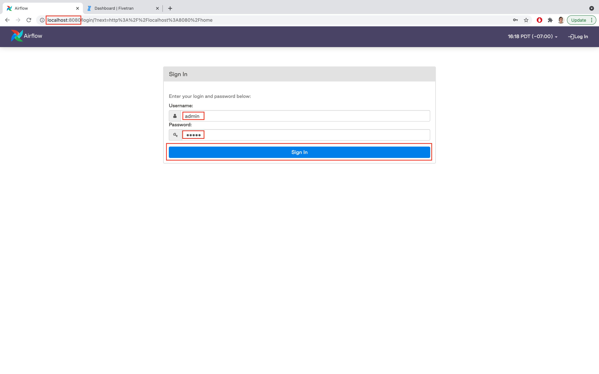
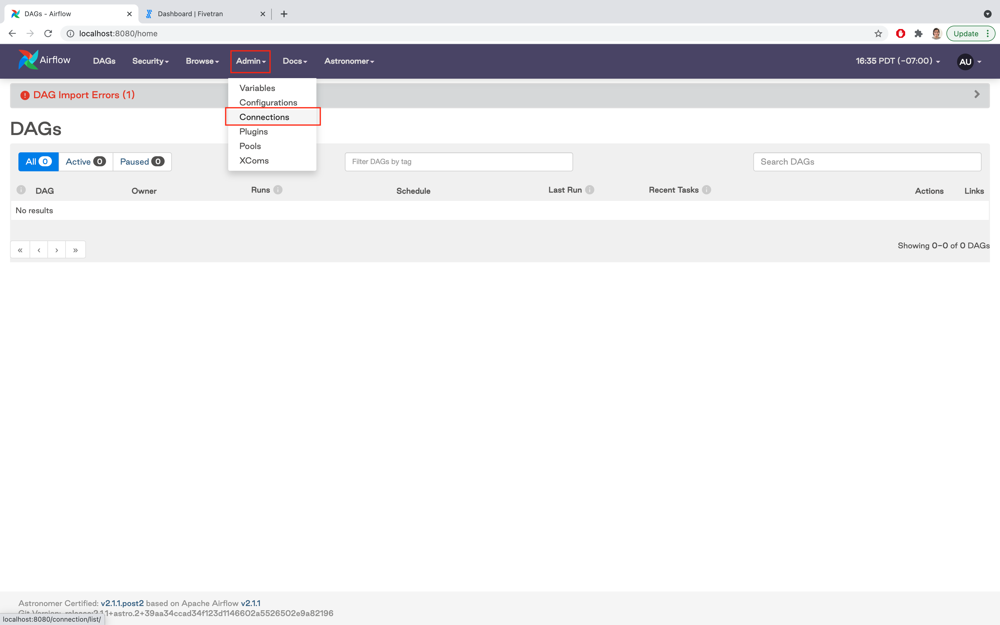
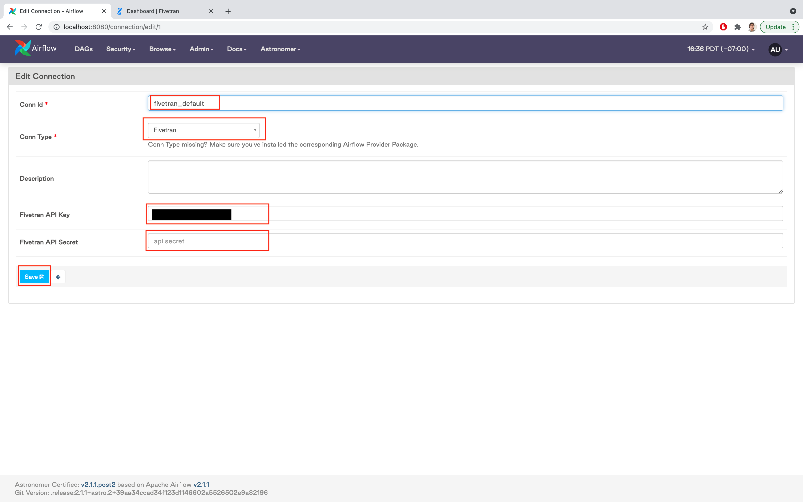
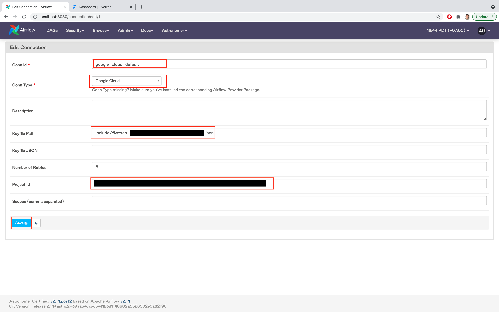
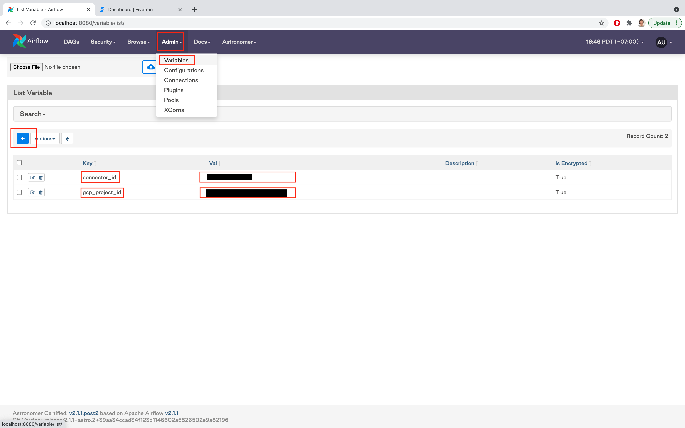
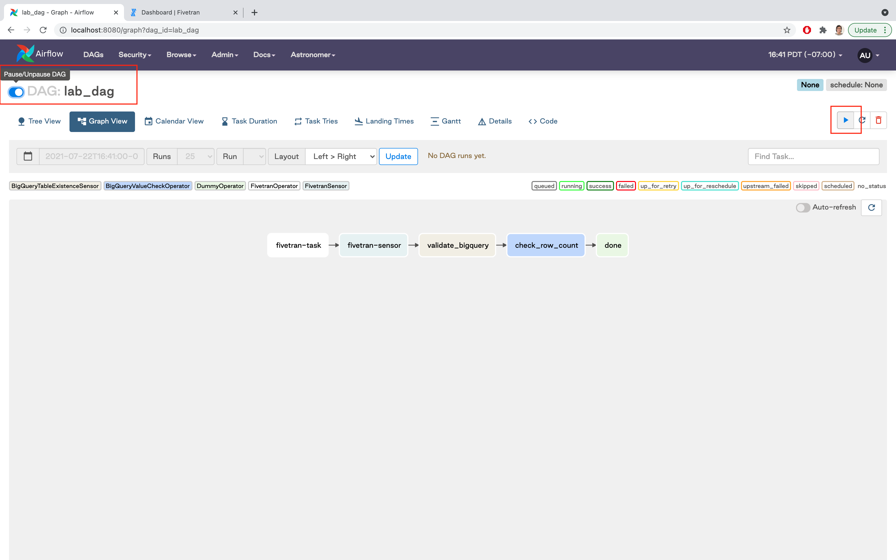

# Fivetran Astronomer Workshop

## Table of Contents
1. [Fivetran](#fivetran)
2. [Astronomer](#astronomer)
3. [Running your first DAG](#dag)

# Fivetran 
This section guides the set up of a Fivetran trial this creates a BigQuery destination to store data that is managed by Fivetran, Fivetran then automates the movement of data into this data warehouse.

|  |
|:--:|
| To start a Fivetran trial, the **E-mail** and **Company** entered cannot have been used for a trial previously. To achieve this, I created an email for this workshop and used it as the Company as well. Select *Sign up* |

|  |
|:--:|
| Select *Verify your Account* in an email from sales@fivetran.com |

|  |
|:--:|
| After creating a password, a Fivetran trial account has been created! Just one connector will be used in this example, select *Set up a connector* |

|  |
|:--:|
| Fivetran will move data from Google Sheets to a data destination, select *Google Sheets* and *CONTINUE SETUP*|

|  |
|:--:|
| With the **Destination schema** as *google_sheets* and **Destination table** as *forestfires*, Fivetran knows where in BigQuery to store data, then select *Grant User Access* and *AUTHORIZE* to select a Google account the Fivetran can use to access the Google sheet. Any Google account will be able to. |

|  |
|:--:|
| The **Sheet URL** is listed below, after copying it, select *alldata* for the **Named Range** and *SAVE & TEST*|

Google Sheet URL
`https://docs.google.com/spreadsheets/d/1Xab8msuo00LKwAWzp1MoXjEgMuUxa4FVfyLipX0ocsA/edit?usp=sharing`

|  |
|:--:|
| After all Connections tests have passed, select *CONTINUE* |

|  |
|:--:|
| Now a new data warehouse will be created, managed and set up as a Fivetran Destination, select *I don't have one* and *CONTINUE SETUP* |

|  |
|:--:|
| These can be left unedited, select **CONTINUE** |

|  |
|:--:|
| Copy the **Project ID** and send it to nick.acosta@fivetran.com, then select **CONTINUE** |

|  |
|:--:|
| Finish Fivetran setup by selecting *Start Inital Sync* |

# Astronomer 

Follow the guide in the link below to get started with Astronomer.
https://www.astronomer.io/docs/cloud/stable/develop/cli-quickstart

Stop before completing **Step 3: Initialize an Airflow Project** a DAG has already been initialized for you

# Running your first DAG 

Clone this repository and cd into it

`git clone https://github.com/PubChimps/FivetranAstronomerWorkshop/`
`cd FivetranAstronomerWorkshop`

Once in the cloned repository, Astronomer can be started 

`astro dev start`

|  |
|:--:|
| Once Astronomer is up and running, access it at *localhost:8080* and log in with the **Username** *admin* and **Password** *admin* |

|  |
|:--:|
| 2 |

|  |
|:--:|
| 3 |

|  |
|:--:|
| 4 |

|  |
|:--:|
| 5 |

|  |
|:--:|
| 6 |

|  |
|:--:|
| 7 |

